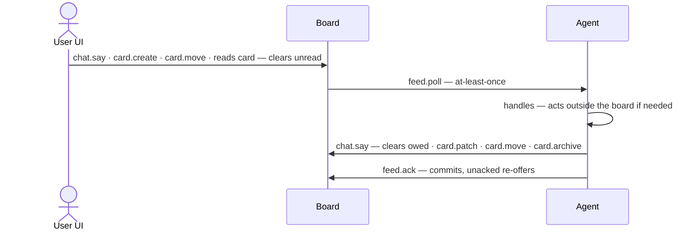

# bridge — Conceptual API (DNA)

> This IS the spec the implementation follows. A disagreement between this document and
> the code is a bug in one of them — change deliberately, never let them drift.

bridge is a generic agent kanban board: a zero-dep node server, a vanilla JS UI for the user, and a CLI for the agent. It knows nothing about any particular agent system — it stores structure, derives a few signals, and delivers messages. The **meaning** of the values a client writes (`type`, custom attributes, worker ids) is the client agent's business.

Columns are **board configuration**, not a fixed set. A client defines whatever columns its workflow needs; the board just holds them.

## Entities

### Card — the unit of work

| attribute | values | meaning |
|---|---|---|
| `title` | text | the face; short, imperative |
| `column` | one of the board's configured columns | owned state — changes ONLY by deliberate `card.move`, never computed |
| `type` | client-defined label | sets the icon and what the body is expected to deliver; semantics belong to the client |
| `tags` | Tag list | free labels for grouping/filtering |
| `artifacts` | list of `{uri, label}` | resource links attached to the card (`file://...`, images, docs) — any agent can hang files on a card; the board can render/open them |
| attributes | client-defined pairs, e.g. `prs`, `repo`, `owner` | opaque renderable structure — link lists `{url, state}`, plain strings. The board renders them; the client gives them meaning |
| `body` | markdown | **the deliverable** — always rewritten to current state; never a log (history lives in events) |
| `status` | Status | the one work signal (below) — first-class, not a loose attribute |
| `events` | Event list | the timeline |
| `thread` | Message list | conversation scoped to this card |

### Event — one timeline entry

| attribute | values | meaning |
|---|---|---|
| `text` | one line | what happened |
| `level` | `1` \| `2` | 1 = rings the user's bell; 2 = timeline only (behind the "· N events" expander) |
| `actor` | `user` \| `agent` \| `feeder` | who caused it — every entry is attributable |

### Message — one chat utterance

| attribute | values | meaning |
|---|---|---|
| `target` | `main` \| card | main chat or a card's thread |
| `author` | `user` \| `agent` | direction |
| `text` | markdown | the content |
| `seq` | ordinal | delivery key — what `feed.ack` commits; the at-least-once contract |

### Status — the ONE work signal

Two separate things, never conflated: **the worker attached to the card** (may not exist) and **the conversation state** (does the agent owe the user a reply). Each signal has a single writer and a defined way back to quiet:

| signal | values | who sets it | how it clears |
|---|---|---|---|
| `worker.id` | opaque id, or none | the client agent, when work is dispatched/linked to the card | work ends or is unlinked → none |
| `worker.state` | `absent` \| `idle` \| `working` \| `needs-you` | the client agent, as a **lease with expiry** — what counts as evidence is the client's policy | lease expires → `idle` (honest "not working", not a guess); no worker → `absent` |
| `owed` | yes/no | **server-derived**: latest thread message is the user's with no agent reply after it | the agent replies |
| `unread` | yes/no | **server-derived**: level-1 event or agent reply landed after the user's last read of the card | the user opens the card |

`worker.*` answers "who is working this card and are they alive?" (no dispatched work = `absent`); `owed` answers "is the agent being responsive in this thread?". Independent — a worker can be `working` while the agent owes a reply, and vice versa.

`owed` requires an actual user thread message: a freshly created card with an empty thread owes nothing. Demand arrives only as a chat/thread message, never from a card's existence.

UI mapping (draft): `worker.state` → stripe (green pulsing = working, gray = idle, amber = needs-you, none = absent); `owed` → "agent owes you a reply" marker; `unread` → badge/bold. No other status source exists.

### Notification — the user's bell

Not a stored entity: the bell is a **derived view of everything the user hasn't seen yet** — same family as `owed`/`unread`; nobody writes it, nothing stored. One mechanism (the per-user read state that already derives `unread`), two scopes:

| source | notifies when | clears when |
|---|---|---|
| level-1 event on a card | lands after the user's last read of that card | the user opens the card |
| agent reply in a card thread | same | the user opens the card |
| agent message in main chat | lands after the user's last view of main chat | the user opens main chat |

- Bell count = unseen items, grouped one line per card (+ one for main chat), newest first; per-card `unread` is this same derivation scoped to one card — the bell is the board-scoped sum.
- Level-2 events NEVER notify — timeline only.
- Clearing is reading. No dismiss operation, no notification objects to garbage-collect; the timeline stays the only history.
- Delivery (sound, browser push, badge style) is a UI concern, outside this concept; the concept is only the derived unseen set.

### Tag — a shared label

| attribute | values | meaning |
|---|---|---|
| `name` | short text | the label; exists once per board |
| `color` | color | stable visual identity — same tag, same color everywhere |

Born on first use (`card.patch` with a new tag name creates it); no dedicated lifecycle operations.

### Archive — where cards go to rest

| attribute | values | meaning |
|---|---|---|
| `card` | frozen Card snapshot | full state at archive time |
| `reason` | `merged` \| `killed` (validated) | why it left; the client decides WHEN to archive. Optional free-text `note` rides along |
| `actor` | `user` \| `agent` | who archived |

Append-only. Nothing is ever deleted. Cards leave the board only by archive.

**Resurrection.** An archive is not a tomb: `card.restore` brings a card **back from the archive** — the most recent frozen snapshot for that id restored in full (body, events, thread, attributes, column as frozen), never a blank rebirth. The return is loud: a level-1 event on the restored card says it was resurrected and by whom (the caller passes the event text; default `resurrected`), so the user sees WHY in the timeline. The archive log stays append-only — the original archive record remains, so a record's existence never implies the card is off the board: **the board is truth for liveness**. The restored card's worker lease starts `absent` until the next `status.set`; `owed` and `unread` re-derive from the restored thread/events and the per-user read state like on any other card.

## Operations

The callable surface; callers are the user's UI and the client agent.

### card
- `card.create(column, title, type, attrs) → card`
- `card.move(card, column)` — deliberate act only (user drag / agent decision); records actor
- `card.patch(card, {title?, body?, attrs?})`
- `card.archive(card)` — the only way off the board
- `card.restore(card)` — back from the archive with frozen state intact (most recent record); records actor; appends the loud level-1 resurrection event. Fails when the card was never archived or is already on the board

### event
- `event.append(card, text, level)`

### chat
- `chat.say(target: main|card, text)` — both directions (user UI / agent CLI)

### feed (agent side)
- `feed.poll() → [message | card-created | card-moved]` — blocks; at-least-once
- `feed.ack(seq)` — commit cursor; unacked re-offers

### status (agent side)
- `status.set(card, worker{id, state})` — only `worker` is writable, as an evidence-based lease; `owed` and `unread` are server-derived, nobody writes them

## Conversation delivery

The user acts on the UI; the agent listens and answers:

Poll → handle → reply → ack. Ack only after handling: the at-least-once contract means an unacked item is re-offered, so a crash between handle and ack duplicates work but never loses it.
