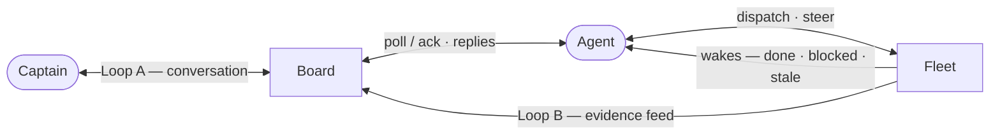
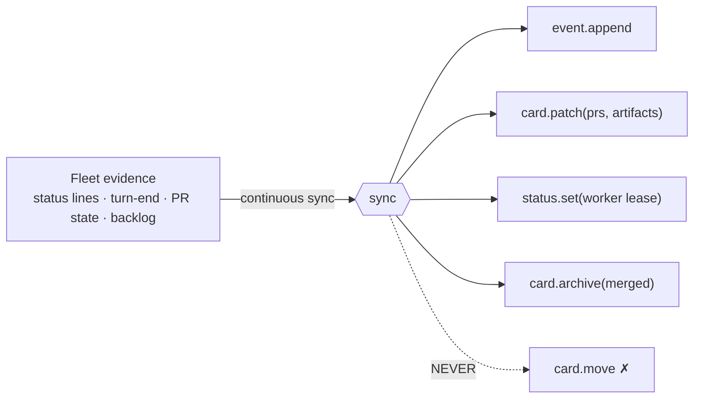
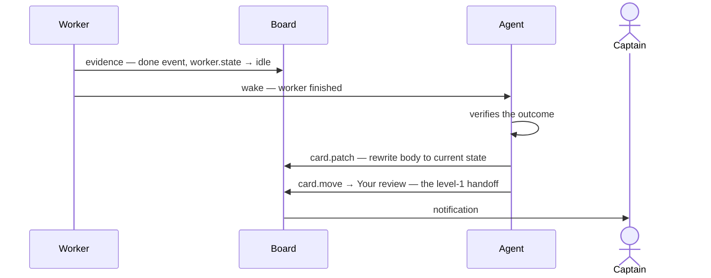

# fleet-bridge — Conceptual API (DNA)

> **Draft target spec.** The upcoming rebuild implements this; current code predates it.

fleet-bridge maps firstmate fleet reality onto a generic [bridge](../../../bridge/docs/api/overview.md) board. Bridge owns structure and mechanics (cards, events, chat, feed, status leases); this layer owns every value's meaning.

**Boundary test**: makes sense for ANY agent running a board → `bridge`. Requires knowing what a crewmate, PR, or backlog is → `fleet-bridge`.

## The board

One board, fixed column frame (a bridge board configuration):

💡 Ideas → 🔨 Working → 👀 Your review → 🤝 Peer review

No Done: cards leave by archive (merge = archive, reason `merged`; captain dismissal = `killed`).

**Territory rule**: up to Your review = agent's; Peer review = captain's (agent touches only to merge-archive).

## Card semantics

| attribute | fleet meaning |
|---|---|
| `type` | `plan` 🧠 \| `implementation` 🔥 \| `investigation` 🕵️‍♂️ — `plan` covers discussion too (a conversation IS early planning) and is the default for captain-created cards |
| `repo` | which project the work belongs to |
| `owner` | which agent home tends this card (firstmate or a secondmate) |
| `prs` | `{url, state: open\|merged\|closed}` — ideally one; odd situations can have several, the card represents them all |
| `artifacts` | `{uri, label}` — anything worth hanging on the card: the worker's brief (`file://...`), images, docs; makes internal agent state reachable |
| `worker.id` | the dispatched task id — links fleet work to its card |
| `worker.state` | lease from **evidence**: status lines, turn-end activity — never screen-pane sampling. Lease expiry → honest `idle` |

**Creating a card is not a demand.** A captain-created card is the captain organizing thought; the `card-created` feed item is awareness only. The agent acts when the captain speaks in a thread or main chat, never inferring a demand from a card's existence.

## Flow — two loops, the agent in the middle

Fleet evidence has **two consumers in parallel**: the board (ambient narration — mechanical, no decisions) and the agent (wakes — where decisions happen). The same "worker finished" fact lands on the card as an event AND wakes the agent to decide what to do about it.

Loop A is bridge's poll/ack delivery (see [Conversation delivery](../../../bridge/docs/api/overview.md#conversation-delivery)); the agent's handling behavior is this layer.

### Loop B — work feed (fleet → board, one-way, ambient)

Owned entirely here; the bridge just receives ordinary API calls. Work happens in the fleet; evidence flows onto cards continuously, with no agent turn needed.

### Where they meet

The agent is the only converter between the loops:

- **A → B**: a captain "go" in a thread becomes dispatched fleet work — which Loop B then narrates onto the same card (via `worker.id` linking).
- **B → A**: work finishing never auto-advances the card. The fleet wake tells the agent; the agent verifies the outcome and turns it into a deliberate handoff:

Loop A is where decisions happen. Loop B is ambient truth. Neither loop moves columns except through a deliberate act by captain or agent.

## Invariants (the big three)

Behavioral contracts, not server enforcement:

1. **Territory** — up to Your review = agent's; Peer review = captain's (agent touches only to merge-archive).
2. **Board = mirror** — firstmate's files stay canonical; disagreement means fix the board.
3. **Sync feeds, never moves** — the feeder appends events/attrs; every column change is a deliberate act.
